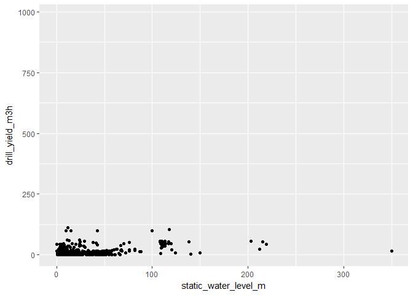

## Data exploration

#### Borehole access

1663 observations, high NA population. Variables with around 50% or less NA's could yield good info. 

Numerical variables of interest:

  - Elevation in meters above sea level
  - Depth in m
  - Static water level in meters below ground level
  - Casing diameter in inch
  - Driller's yield in m3/hr
  - Daily pumping time in h

Look at categorical variables like:

  - Country
  - Drilling date
  - Status


```r
summary(borehole_access)
```

```
##      Iso3             Country            Site ID         
##  Length:1663        Length:1663        Length:1663       
##  Class :character   Class :character   Class :character  
##  Mode  :character   Mode  :character   Mode  :character  
##                                                          
##                                                          
##                                                          
##                                                          
##   Site name         Borehole name      Automatic Borehole ID
##  Length:1663        Length:1663        Length:1663          
##  Class :character   Class :character   Class :character     
##  Mode  :character   Mode  :character   Mode  :character     
##                                                             
##                                                             
##                                                             
##                                                             
##  Local Borehole ID     Latitude         Longitude     
##  Length:1663        Min.   :-21.072   Min.   :-8.067  
##  Class :character   1st Qu.:  1.146   1st Qu.:20.768  
##  Mode  :character   Median :  3.379   Median :31.083  
##                     Mean   :  3.732   Mean   :26.861  
##                     3rd Qu.:  8.164   3rd Qu.:31.960  
##                     Max.   : 34.664   Max.   :88.075  
##                                                       
##  Elevation in meters above sea level    Status          Drilling date     
##  Min.   :  25.0                      Length:1663        Length:1663       
##  1st Qu.: 434.5                      Class :character   Class :character  
##  Median : 721.5                      Mode  :character   Mode  :character  
##  Mean   : 752.0                                                           
##  3rd Qu.:1090.8                                                           
##  Max.   :3522.0                                                           
##  NA's   :609                                                              
##  Last editor        Date of update       Depth in m    
##  Length:1663        Length:1663        Min.   :  3.50  
##  Class :character   Class :character   1st Qu.: 41.76  
##  Mode  :character   Mode  :character   Median : 54.00  
##                                        Mean   : 67.75  
##                                        3rd Qu.: 80.00  
##                                        Max.   :722.84  
##                                        NA's   :749     
##  Static water level in meters below ground level Type of pump      
##  Min.   : -0.40                                  Length:1663       
##  1st Qu.:  6.23                                  Class :character  
##  Median : 12.34                                  Mode  :character  
##  Mean   : 22.39                                                    
##  3rd Qu.: 23.00                                                    
##  Max.   :350.00                                                    
##  NA's   :851                                                       
##  Pump brand and model Pump depth in m  Pump motor power in kilowatt
##  Length:1663          Min.   :  3.00   Min.   : 0.16               
##  Class :character     1st Qu.: 24.00   1st Qu.: 1.75               
##  Mode  :character     Median : 36.00   Median : 5.50               
##                       Mean   : 46.59   Mean   : 8.98               
##                       3rd Qu.: 60.00   3rd Qu.:11.00               
##                       Max.   :408.00   Max.   :90.00               
##                       NA's   :1118     NA's   :1375                
##  Energy source      Generator brand and model
##  Length:1663        Length:1663              
##  Class :character   Class :character         
##  Mode  :character   Mode  :character         
##                                              
##                                              
##                                              
##                                              
##  Generator capacity in kilovolt-ampere (kVA) Casing diameter in inch
##  Min.   :  0.60                              Min.   :  3.000        
##  1st Qu.: 20.00                              1st Qu.:  4.500        
##  Median : 33.00                              Median :  5.000        
##  Mean   : 47.02                              Mean   :  7.075        
##  3rd Qu.: 61.50                              3rd Qu.:  6.000        
##  Max.   :165.00                              Max.   :125.000        
##  NA's   :1556                                NA's   :788            
##  Casing material    1st screened area - from in m
##  Length:1663        Min.   :  1.70               
##  Class :character   1st Qu.: 24.00               
##  Mode  :character   Median : 35.92               
##                     Mean   : 48.82               
##                     3rd Qu.: 56.12               
##                     Max.   :683.51               
##                     NA's   :1361                 
##  1st screened area - to in m 2nd screened area - from in m
##  Min.   :  7.50              Min.   : 18.50               
##  1st Qu.: 34.00              1st Qu.: 34.95               
##  Median : 48.00              Median : 43.10               
##  Mean   : 66.82              Mean   : 54.92               
##  3rd Qu.: 68.51              3rd Qu.: 63.30               
##  Max.   :716.09              Max.   :207.00               
##  NA's   :1375                NA's   :1588                 
##  2nd screened area - to in m 3rd screened area - from in m
##  Min.   : 23.56              Min.   : 27.00               
##  1st Qu.: 39.15              1st Qu.: 44.60               
##  Median : 51.00              Median : 52.55               
##  Mean   : 62.98              Mean   : 60.39               
##  3rd Qu.: 72.50              3rd Qu.: 69.42               
##  Max.   :225.00              Max.   :141.01               
##  NA's   :1588                NA's   :1623                 
##  3rd screened area - to in m Aquifer type       Driller's yield in m3/hr
##  Min.   : 30.00              Length:1663        Min.   :  0.216         
##  1st Qu.: 47.55              Class :character   1st Qu.:  1.270         
##  Median : 57.20              Mode  :character   Median :  3.000         
##  Mean   : 66.41                                 Mean   : 27.522         
##  3rd Qu.: 75.49                                 3rd Qu.: 12.000         
##  Max.   :158.80                                 Max.   :981.818         
##  NA's   :1623                                   NA's   :751             
##  Daily pumping time in h Date of last water quality control
##  Min.   : 1.00           Length:1663                       
##  1st Qu.:10.00           Class :character                  
##  Median :12.00           Mode  :character                  
##  Mean   :10.94                                             
##  3rd Qu.:12.00                                             
##  Max.   :24.00                                             
##  NA's   :869                                               
##  Conductivity in micro S/cm (microsiemen/cm)       pH       
##  Min.   :   5.58                             Min.   :4.400  
##  1st Qu.: 133.75                             1st Qu.:6.242  
##  Median : 405.00                             Median :6.800  
##  Mean   : 517.98                             Mean   :6.734  
##  3rd Qu.: 657.25                             3rd Qu.:7.272  
##  Max.   :3900.00                             Max.   :9.950  
##  NA's   :1221                                NA's   :1229   
##  Turbidity in NTU  Ammonia concentration in mg/L
##  Min.   :  0.020   Min.   :0.0100               
##  1st Qu.:  2.500   1st Qu.:0.0500               
##  Median :  2.500   Median :0.1100               
##  Mean   :  5.379   Mean   :0.3258               
##  3rd Qu.:  5.000   3rd Qu.:0.3950               
##  Max.   :123.000   Max.   :2.2800               
##  NA's   :1224      NA's   :1611                 
##  Arsenic concentration in micro g/L Fluoride concentration in mg/L
##  Min.   : 0.010                     Min.   :0.0090                
##  1st Qu.: 4.250                     1st Qu.:0.1600                
##  Median : 5.000                     Median :0.3650                
##  Mean   : 5.335                     Mean   :0.6107                
##  3rd Qu.: 7.250                     3rd Qu.:0.6375                
##  Max.   :10.000                     Max.   :4.6000                
##  NA's   :1657                       NA's   :1491                  
##  Nitrate concentration in mg/L Nitrite concentration in mg/L
##  Min.   :  0.009               Min.   :0.0010               
##  1st Qu.:  0.040               1st Qu.:0.0060               
##  Median :  0.500               Median :0.0100               
##  Mean   :  6.894               Mean   :0.1482               
##  3rd Qu.:  3.100               3rd Qu.:0.0925               
##  Max.   :139.000               Max.   :1.8000               
##  NA's   :1470                  NA's   :1552                 
##  External link 1    External link 2    External link 3   
##  Length:1663        Length:1663        Length:1663       
##  Class :character   Class :character   Class :character  
##  Mode  :character   Mode  :character   Mode  :character  
##                                                          
##                                                          
##                                                          
##                                                          
##  External link 4    Attachment description   Comments        
##  Length:1663        Length:1663            Length:1663       
##  Class :character   Class :character       Class :character  
##  Mode  :character   Mode  :character       Mode  :character  
##                                                              
##                                                              
##                                                              
## 
```

```r
glimpse(borehole_access)
```

```
## Observations: 1,663
## Variables: 49
## $ Iso3                                              <chr> "UGA", "NPL"...
## $ Country                                           <chr> "Uganda", "N...
## $ `Site ID`                                         <chr> "UGAs990099"...
## $ `Site name`                                       <chr> "Rhino Camp"...
## $ `Borehole name`                                   <chr> NA, NA, NA, ...
## $ `Automatic Borehole ID`                           <chr> "UGA-UGAs990...
## $ `Local Borehole ID`                               <chr> "Unknown", "...
## $ Latitude                                          <dbl> 3.0486600, 2...
## $ Longitude                                         <dbl> 32.31188, 87...
## $ `Elevation in meters above sea level`             <dbl> 651, 174, 17...
## $ Status                                            <chr> "active", "i...
## $ `Drilling date`                                   <chr> "15-4-2014",...
## $ `Last editor`                                     <chr> NA, NA, NA, ...
## $ `Date of update`                                  <chr> NA, NA, NA, ...
## $ `Depth in m`                                      <dbl> NA, 60, 60, ...
## $ `Static water level in meters below ground level` <dbl> NA, NA, NA, ...
## $ `Type of pump`                                    <chr> "hand_pump",...
## $ `Pump brand and model`                            <chr> NA, NA, NA, ...
## $ `Pump depth in m`                                 <dbl> NA, NA, NA, ...
## $ `Pump motor power in kilowatt`                    <dbl> NA, NA, NA, ...
## $ `Energy source`                                   <chr> NA, NA, NA, ...
## $ `Generator brand and model`                       <chr> NA, NA, NA, ...
## $ `Generator capacity in kilovolt-ampere (kVA)`     <dbl> NA, NA, NA, ...
## $ `Casing diameter in inch`                         <dbl> NA, NA, NA, ...
## $ `Casing material`                                 <chr> NA, NA, NA, ...
## $ `1st screened area - from in m`                   <dbl> NA, NA, NA, ...
## $ `1st screened area - to in m`                     <dbl> NA, NA, NA, ...
## $ `2nd screened area - from in m`                   <dbl> NA, NA, NA, ...
## $ `2nd screened area - to in m`                     <dbl> NA, NA, NA, ...
## $ `3rd screened area - from in m`                   <dbl> NA, NA, NA, ...
## $ `3rd screened area - to in m`                     <dbl> NA, NA, NA, ...
## $ `Aquifer type`                                    <chr> NA, NA, NA, ...
## $ `Driller's yield in m3/hr`                        <dbl> 0.800, NA, N...
## $ `Daily pumping time in h`                         <dbl> 8.00, NA, NA...
## $ `Date of last water quality control`              <chr> "25-11-2016"...
## $ `Conductivity in micro S/cm (microsiemen/cm)`     <dbl> 340, NA, NA,...
## $ pH                                                <dbl> NA, NA, NA, ...
## $ `Turbidity in NTU`                                <dbl> NA, NA, NA, ...
## $ `Ammonia concentration in mg/L`                   <dbl> NA, NA, NA, ...
## $ `Arsenic concentration in micro g/L`              <dbl> NA, NA, NA, ...
## $ `Fluoride concentration in mg/L`                  <dbl> NA, NA, NA, ...
## $ `Nitrate concentration in mg/L`                   <dbl> NA, NA, NA, ...
## $ `Nitrite concentration in mg/L`                   <dbl> NA, NA, NA, ...
## $ `External link 1`                                 <chr> NA, NA, NA, ...
## $ `External link 2`                                 <chr> NA, NA, NA, ...
## $ `External link 3`                                 <chr> NA, NA, NA, ...
## $ `External link 4`                                 <chr> NA, NA, NA, ...
## $ `Attachment description`                          <chr> NA, NA, NA, ...
## $ Comments                                          <chr> "BH located ...
```

```r
# restrict dataset to numerical vars of interest and rename
borehole_access_restricted <- borehole_access %>%
  select("Country", 
         "Status",
         "Elevation in meters above sea level", 
         "Depth in m", 
         "Static water level in meters below ground level", 
         "Casing diameter in inch", 
         "Driller's yield in m3/hr", 
         "Daily pumping time in h") %>%
  rename(country = "Country", 
         status = "Status", 
         elevation_m = "Elevation in meters above sea level", 
         depth_m = "Depth in m", 
         static_water_level_m = "Static water level in meters below ground level", 
         casing_diameter_inch = "Casing diameter in inch", 
         drill_yield_m3h = "Driller's yield in m3/hr", 
         daily_pumping_h = "Daily pumping time in h")

# explore dataset
### by country
glimpse(borehole_access_restricted)
```

```
## Observations: 1,663
## Variables: 8
## $ country              <chr> "Uganda", "Nepal", "Nepal", "Nepal", "Nep...
## $ status               <chr> "active", "inactive", "inactive", "inacti...
## $ elevation_m          <dbl> 651, 174, 172, 286, 283, 115, 118, 179, 1...
## $ depth_m              <dbl> NA, 60, 60, 75, 102, 40, 90, 60, 65, 80, ...
## $ static_water_level_m <dbl> NA, NA, NA, NA, NA, NA, NA, NA, NA, NA, N...
## $ casing_diameter_inch <dbl> NA, NA, NA, NA, NA, NA, NA, NA, NA, NA, N...
## $ drill_yield_m3h      <dbl> 0.800, NA, NA, NA, NA, NA, NA, NA, NA, NA...
## $ daily_pumping_h      <dbl> 8.00, NA, NA, NA, NA, NA, NA, NA, NA, NA,...
```

```r
(plot_country_pumping <- borehole_access_restricted %>%
  ggplot(aes(country, daily_pumping_h)) +
  geom_point() +
  theme(axis.text.x = element_text(angle = 75, hjust = 1)))
```

```
## Warning: Removed 869 rows containing missing values (geom_point).
```

<!-- -->

```r
(plot_country_elev <- borehole_access_restricted %>%
  ggplot(aes(country, elevation_m)) +
  geom_point() +
  theme(axis.text.x = element_text(angle = 75, hjust = 1)))
```

```
## Warning: Removed 609 rows containing missing values (geom_point).
```

<!-- -->

```r
(plot_country_depth <- borehole_access_restricted %>%
  ggplot(aes(country, depth_m)) +
  geom_point() +
  theme(axis.text.x = element_text(angle = 75, hjust = 1)))
```

```
## Warning: Removed 749 rows containing missing values (geom_point).
```

<!-- -->

```r
(plot_country_staticlevel <- borehole_access_restricted %>%
  ggplot(aes(country, static_water_level_m)) +
  geom_point() +
  theme(axis.text.x = element_text(angle = 75, hjust = 1)))
```

```
## Warning: Removed 851 rows containing missing values (geom_point).
```

<!-- -->

```r
(plot_country_casingdiam <- borehole_access_restricted %>%
  ggplot(aes(country, casing_diameter_inch)) +
  geom_point() +
  theme(axis.text.x = element_text(angle = 75, hjust = 1)))
```

```
## Warning: Removed 788 rows containing missing values (geom_point).
```

<!-- -->

```r
(plot_country_depth <- borehole_access_restricted %>%
  ggplot(aes(country, depth_m)) +
  geom_point() +
  theme(axis.text.x = element_text(angle = 75, hjust = 1)))
```

```
## Warning: Removed 749 rows containing missing values (geom_point).
```

<!-- -->

```r
### explore relationships between borehole variables - depth through daily pumping
(plot_depth_drillyield <- borehole_access_restricted %>%
  ggplot(aes(depth_m, drill_yield_m3h)) +
  geom_point())
```

```
## Warning: Removed 978 rows containing missing values (geom_point).
```

<!-- -->

```r
(plot_depth_staticwater <- borehole_access_restricted %>%
  ggplot(aes(depth_m, static_water_level_m)) +
  geom_point())
```

```
## Warning: Removed 915 rows containing missing values (geom_point).
```

<!-- -->

```r
(plot_depth_casing <- borehole_access_restricted %>%
  ggplot(aes(depth_m, casing_diameter_inch)) +
  geom_point())
```

```
## Warning: Removed 964 rows containing missing values (geom_point).
```

<!-- -->

```r
(plot_depth_pumping <- borehole_access_restricted %>%
  ggplot(aes(depth_m, daily_pumping_h)) +
  geom_point())
```

```
## Warning: Removed 1051 rows containing missing values (geom_point).
```

<!-- -->

```r
(plot_depth_casing <- borehole_access_restricted %>%
  ggplot(aes(depth_m, casing_diameter_inch)) +
  geom_point())
```

```
## Warning: Removed 964 rows containing missing values (geom_point).
```

<!-- -->

```r
(plot_drill_pump <- borehole_access_restricted %>%
  ggplot(aes(drill_yield_m3h, daily_pumping_h)) +
  geom_point())
```

```
## Warning: Removed 1001 rows containing missing values (geom_point).
```

<!-- -->

```r
(plot_static_drill <- borehole_access_restricted %>%
  ggplot(aes(static_water_level_m, drill_yield_m3h)) +
  geom_point())
```

```
## Warning: Removed 986 rows containing missing values (geom_point).
```

<!-- -->


### Camp usage

796 observations. Same criteria as above - look at variables with approx < 50% NA's. 

Variables of interest:

  - COUNTRY NAME
  - EMERGENCY / POST-EMERGENCY
  - AVERAGE # LITERS OF POTABLE WATER AVAILABLE PER PERSON PER DAY
  - NUMBER OF PERSONS PER USABLE WATER TAP
  -  % OF WATER QUALITY TESTS AT CHLORINATED COLLECTION LOCATIONS WITH FRC IN THE RANGE 0.2-2MG/L AND TURBIDITY <5NTU5
  - NUMBER OF PERSONS PER TOILET/LATRINE
  - NUMBER OF PERSONS PER BATH SHELTER/SHOWER
  - NUMBER OF PERSONS PER HYGIENE PROMOTER
  - REFUGEE POPULATION


```r
summary(camp_usage)
```

```
##    FORM ID           DATE START           DATE END         
##  Length:796         Length:796         Min.   :2015-12-31  
##  Class :character   Class :character   1st Qu.:2019-02-03  
##  Mode  :character   Mode  :character   Median :2019-04-28  
##                                        Mean   :2019-03-13  
##                                        3rd Qu.:2019-06-30  
##                                        Max.   :2019-12-31  
##                                        NA's   :2           
##   LOCATION ID     LOCATION NAME      COUNTRY NAME      
##  Min.   : 209.0   Length:796         Length:796        
##  1st Qu.: 486.0   Class :character   Class :character  
##  Median : 541.0   Mode  :character   Mode  :character  
##  Mean   : 895.9                                        
##  3rd Qu.: 600.0                                        
##  Max.   :4308.0                                        
##  NA's   :2                                             
##  EMERGENCY / POST-EMERGENCY
##  Length:796                
##  Class :character          
##  Mode  :character          
##                            
##                            
##                            
##                            
##  NUMBER OF PERSONS PER USABLE HANDPUMP / WELL / SPRING
##  Min.   :   0                                         
##  1st Qu.: 250                                         
##  Median : 620                                         
##  Mean   :1254                                         
##  3rd Qu.:1145                                         
##  Max.   :8196                                         
##  NA's   :581                                          
##  NUMBER OF PERSONS PER USABLE WATER TAP
##  Min.   :    1.0                       
##  1st Qu.:   61.0                       
##  Median :   99.0                       
##  Mean   :  213.2                       
##  3rd Qu.:  163.0                       
##  Max.   :13576.0                       
##  NA's   :281                           
##  AVERAGE # LITERS OF POTABLE WATER AVAILABLE PER PERSON PER DAY
##  Min.   :  0.00                                                
##  1st Qu.: 13.00                                                
##  Median : 18.00                                                
##  Mean   : 21.96                                                
##  3rd Qu.: 22.00                                                
##  Max.   :128.00                                                
##  NA's   :112                                                   
##  % WATER QUALITY TESTS AT NON CHLORINATED WATER COLLECTION LOCATIONS WITH 0 CFU/100ML
##  Min.   :  0.00                                                                      
##  1st Qu.:100.00                                                                      
##  Median :100.00                                                                      
##  Mean   : 94.55                                                                      
##  3rd Qu.:100.00                                                                      
##  Max.   :100.00                                                                      
##  NA's   :457                                                                         
##  % OF WATER QUALITY TESTS AT CHLORINATED COLLECTION LOCATIONS WITH FRC IN THE RANGE 0.2-2MG/L AND TURBIDITY <5NTU5
##  Min.   :  0.00                                                                                                   
##  1st Qu.:100.00                                                                                                   
##  Median :100.00                                                                                                   
##  Mean   : 91.97                                                                                                   
##  3rd Qu.:100.00                                                                                                   
##  Max.   :101.00                                                                                                   
##  NA's   :271                                                                                                      
##  NUMBER OF PERSONS PER TOILET/LATRINE
##  Min.   :  1.00                      
##  1st Qu.:  7.00                      
##  Median : 11.00                      
##  Mean   : 16.22                      
##  3rd Qu.: 20.00                      
##  Max.   :317.00                      
##  NA's   :117                         
##  NUMBER OF PERSONS PER BATH SHELTER/SHOWER
##  Min.   :   0.00                          
##  1st Qu.:   6.00                          
##  Median :  16.00                          
##  Mean   :  43.93                          
##  3rd Qu.:  36.00                          
##  Max.   :1860.00                          
##  NA's   :221                              
##  NUMBER OF PERSONS PER HYGIENE PROMOTER REFUGEE POPULATION
##  Min.   :   67                          Min.   :   199    
##  1st Qu.:  505                          1st Qu.:  9916    
##  Median :  878                          Median : 18124    
##  Mean   : 1609                          Mean   : 32606    
##  3rd Qu.: 1825                          3rd Qu.: 42382    
##  Max.   :15692                          Max.   :223939    
##  NA's   :209                            NA's   :112       
##  REPORTING PERIOD - MONTHLY INDICATOR
##  Min.   :2018-01-01                  
##  1st Qu.:2019-02-01                  
##  Median :2019-04-01                  
##  Mean   :2019-03-31                  
##  3rd Qu.:2019-07-01                  
##  Max.   :2019-09-01                  
##  NA's   :102                         
##  AVERAGE # L/P/D OF POTABLE WATER COLLECTED AT HOUSEHOLD LEVEL
##  Min.   :  6.10                                               
##  1st Qu.: 14.05                                               
##  Median : 16.95                                               
##  Mean   : 23.40                                               
##  3rd Qu.: 28.40                                               
##  Max.   :100.00                                               
##  NA's   :702                                                  
##  % HOUSEHOLDS WITH AT LEAST 10 LITERS/PERSON POTABLE WATER STORAGE CAPACITY
##  Min.   : 22.97                                                            
##  1st Qu.: 59.20                                                            
##  Median : 96.00                                                            
##  Mean   : 79.08                                                            
##  3rd Qu.:100.00                                                            
##  Max.   :100.00                                                            
##  NA's   :743                                                               
##  % HOUSEHOLDS COLLECTING DRINKING WATER FROM PROTECTED/TREATED SOURCES
##  Min.   :  0.97                                                       
##  1st Qu.: 96.00                                                       
##  Median : 99.00                                                       
##  Mean   : 93.33                                                       
##  3rd Qu.:100.00                                                       
##  Max.   :100.00                                                       
##  NA's   :700                                                          
##  % HOUSEHOLDS WITH HOUSEHOLD TOILET/LATRINE
##  Min.   :  0.00                            
##  1st Qu.: 44.55                            
##  Median : 70.00                            
##  Mean   : 64.26                            
##  3rd Qu.: 90.10                            
##  Max.   :100.00                            
##  NA's   :709                               
##  % HOUSEHOLDS REPORTING DEFECATING IN A TOILET
##  Min.   :  4.00                               
##  1st Qu.: 78.75                               
##  Median : 90.70                               
##  Mean   : 84.02                               
##  3rd Qu.: 97.00                               
##  Max.   :100.00                               
##  NA's   :704                                  
##  % HOUSEHOLDS WITH ACCESS TO SOAP
##  Min.   : 14.00                  
##  1st Qu.: 63.25                  
##  Median : 76.50                  
##  Mean   : 73.58                  
##  3rd Qu.: 85.00                  
##  Max.   :100.00                  
##  NA's   :706                     
##  % HOUSEHOLDS WITH ACCESS TO SOLID WASTE DISPOSAL FACILITY
##  Min.   :  5.00                                           
##  1st Qu.: 48.00                                           
##  Median : 74.00                                           
##  Mean   : 66.83                                           
##  3rd Qu.: 89.00                                           
##  Max.   :100.00                                           
##  NA's   :723                                              
##  REPORTING PERIOD - ANNUAL INDICATOR
##  Min.   :2015-03-01                 
##  1st Qu.:2017-04-16                 
##  Median :2018-09-01                 
##  Mean   :2018-02-12                 
##  3rd Qu.:2018-11-01                 
##  Max.   :2019-05-01                 
##  NA's   :721
```

```r
glimpse(camp_usage)
```

```
## Observations: 796
## Variables: 25
## $ `FORM ID`                                                                                                           <chr> ...
## $ `DATE START`                                                                                                        <chr> ...
## $ `DATE END`                                                                                                          <date> ...
## $ `LOCATION ID`                                                                                                       <int> ...
## $ `LOCATION NAME`                                                                                                     <chr> ...
## $ `COUNTRY NAME`                                                                                                      <chr> ...
## $ `EMERGENCY / POST-EMERGENCY`                                                                                        <chr> ...
## $ `NUMBER OF PERSONS PER USABLE HANDPUMP / WELL / SPRING`                                                             <int> ...
## $ `NUMBER OF PERSONS PER USABLE WATER TAP`                                                                            <int> ...
## $ `AVERAGE # LITERS OF POTABLE WATER AVAILABLE PER PERSON PER DAY`                                                    <int> ...
## $ `% WATER QUALITY TESTS AT NON CHLORINATED WATER COLLECTION LOCATIONS WITH 0 CFU/100ML`                              <int> ...
## $ `% OF WATER QUALITY TESTS AT CHLORINATED COLLECTION LOCATIONS WITH FRC IN THE RANGE 0.2-2MG/L AND TURBIDITY <5NTU5` <int> ...
## $ `NUMBER OF PERSONS PER TOILET/LATRINE`                                                                              <int> ...
## $ `NUMBER OF PERSONS PER BATH SHELTER/SHOWER`                                                                         <int> ...
## $ `NUMBER OF PERSONS PER HYGIENE PROMOTER`                                                                            <int> ...
## $ `REFUGEE POPULATION`                                                                                                <int> ...
## $ `REPORTING PERIOD - MONTHLY INDICATOR`                                                                              <date> ...
## $ `AVERAGE # L/P/D OF POTABLE WATER COLLECTED AT HOUSEHOLD LEVEL`                                                     <dbl> ...
## $ `% HOUSEHOLDS WITH AT LEAST 10 LITERS/PERSON POTABLE WATER STORAGE CAPACITY`                                        <dbl> ...
## $ `% HOUSEHOLDS COLLECTING DRINKING WATER FROM PROTECTED/TREATED SOURCES`                                             <dbl> ...
## $ `% HOUSEHOLDS WITH HOUSEHOLD TOILET/LATRINE`                                                                        <dbl> ...
## $ `% HOUSEHOLDS REPORTING DEFECATING IN A TOILET`                                                                     <dbl> ...
## $ `% HOUSEHOLDS WITH ACCESS TO SOAP`                                                                                  <dbl> ...
## $ `% HOUSEHOLDS WITH ACCESS TO SOLID WASTE DISPOSAL FACILITY`                                                         <dbl> ...
## $ `REPORTING PERIOD - ANNUAL INDICATOR`                                                                               <date> ...
```

```r
# restrict to vars of interest and rename
camp_usage_restricted <- camp_usage %>%
  select("COUNTRY NAME", 
         "EMERGENCY / POST-EMERGENCY", 
         "AVERAGE # LITERS OF POTABLE WATER AVAILABLE PER PERSON PER DAY", 
         "NUMBER OF PERSONS PER USABLE WATER TAP", 
         "% OF WATER QUALITY TESTS AT CHLORINATED COLLECTION LOCATIONS WITH FRC IN THE RANGE 0.2-2MG/L AND TURBIDITY <5NTU5", 
         "NUMBER OF PERSONS PER TOILET/LATRINE", 
         "NUMBER OF PERSONS PER BATH SHELTER/SHOWER", 
         "NUMBER OF PERSONS PER HYGIENE PROMOTER", 
         "REFUGEE POPULATION") %>%
  rename(country = "COUNTRY NAME", 
         emergency_status = "EMERGENCY / POST-EMERGENCY", 
         water_per_person_l = "AVERAGE # LITERS OF POTABLE WATER AVAILABLE PER PERSON PER DAY", 
         persons_per_tap = "NUMBER OF PERSONS PER USABLE WATER TAP", 
         quality_tests = "% OF WATER QUALITY TESTS AT CHLORINATED COLLECTION LOCATIONS WITH FRC IN THE RANGE 0.2-2MG/L AND TURBIDITY <5NTU5",
         persons_per_toilet = "NUMBER OF PERSONS PER TOILET/LATRINE", 
         persons_per_shower = "NUMBER OF PERSONS PER BATH SHELTER/SHOWER", 
         persons_per_hygienepromoter = "NUMBER OF PERSONS PER HYGIENE PROMOTER", 
         refugee_population = "REFUGEE POPULATION")

# water quality tests vs other vars
(plot_tests_toilet <- camp_usage_restricted %>%
  ggplot(aes(quality_tests, persons_per_toilet)) +
  geom_point())
```

```
## Warning: Removed 271 rows containing missing values (geom_point).
```

<!-- -->

```r
(plot_tests_water <- camp_usage_restricted %>%
  ggplot(aes(quality_tests, water_per_person_l)) +
  geom_point())
```

```
## Warning: Removed 271 rows containing missing values (geom_point).
```

<!-- -->

```r
(plot_tests_tap <- camp_usage_restricted %>%
  ggplot(aes(quality_tests, persons_per_tap)) +
  geom_point())
```

```
## Warning: Removed 340 rows containing missing values (geom_point).
```

<!-- -->

```r
(plot_tests_shower <- camp_usage_restricted %>%
  ggplot(aes(quality_tests, persons_per_shower)) +
  geom_point())
```

```
## Warning: Removed 353 rows containing missing values (geom_point).
```

<!-- -->

```r
(plot_tests_hygiene <- camp_usage_restricted %>%
  ggplot(aes(quality_tests, persons_per_hygienepromoter)) +
  geom_point())
```

```
## Warning: Removed 311 rows containing missing values (geom_point).
```

<!-- -->

```r
(plot_tests_pop <- camp_usage_restricted %>%
  ggplot(aes(quality_tests, refugee_population)) +
  geom_point())
```

```
## Warning: Removed 271 rows containing missing values (geom_point).
```

<!-- -->

```r
# plotting the distributions of water per person, ppl per tap etc by country would be illustrative when compared with US
# measure water resource crowdedness by country - persons per xyz with additional measure for water per person
(plot_country_tap <- camp_usage_restricted %>%
  ggplot(aes(reorder(country, log(persons_per_tap)), log(persons_per_tap))) +
  geom_jitter(position = position_jitter(w = .2), 
              alpha = .3) +
  theme(axis.text.x = element_text(angle = 75, hjust = 1)))
```

```
## Warning: Removed 281 rows containing missing values (geom_point).
```

<!-- -->

```r
(plot_country_water <- camp_usage_restricted %>%
  ggplot(aes(country, water_per_person_l)) +
  geom_jitter(position = position_jitter(w = .2), 
              alpha = .3) +
  theme(axis.text.x = element_text(angle = 75, hjust = 1)))
```

```
## Warning: Removed 112 rows containing missing values (geom_point).
```

<!-- -->

```r
(plot_country_pop <- camp_usage_restricted %>%
  ggplot(aes(reorder(country, refugee_population), refugee_population)) +
  geom_jitter(position = position_jitter(w = .2), 
              alpha = .3) +
  theme(axis.text.x = element_text(angle = 75, hjust = 1)))
```

```
## Warning: Removed 112 rows containing missing values (geom_point).
```

<!-- -->

```r
(plot_country_toilet <- camp_usage_restricted %>%
  ggplot(aes(reorder(country, persons_per_toilet), persons_per_toilet)) +
  geom_jitter(position = position_jitter(w = .2), 
              alpha = .3) +
  theme(axis.text.x = element_text(angle = 75, hjust = 1)))
```

```
## Warning: Removed 117 rows containing missing values (geom_point).
```

<!-- -->

```r
(plot_country_hygiene <- camp_usage_restricted %>%
  ggplot(aes(reorder(country, persons_per_hygienepromoter), persons_per_hygienepromoter)) +
  geom_jitter(position = position_jitter(w = .2), 
              alpha = .3) +
  theme(axis.text.x = element_text(angle = 75, hjust = 1)))
```

```
## Warning: Removed 209 rows containing missing values (geom_point).
```

<!-- -->


### US usage

with the exception of 4 NA's (out of 3223 total observations) in DO-PSPCp, dataset is complete.

rename variables to make them more intuitive

from the data dictionary this is what they mean 

STATE	State postal abbreviation
STATEFIPS	State FIPS code
COUNTY	County name
COUNTYFIPS	County FIPS code
FIPS	Concatenated State-county FIPS code
YEAR	Year of data=2015
TP-TotPop	Total population of county, in thousands
DO-SSPop	Domestic, self-supplied population, in thousands
DO-WGWFr	Domestic, self-supplied groundwater withdrawals, fresh, in Mgal/d
DO-WSWFr	Domestic, self-supplied surface-water withdrawals, fresh, in Mgal/d
DO-WFrTo	Domestic, total self-supplied withdrawals, fresh, in Mgal/d
DO-SSPCp	Domestic, self-supplied per capita use, in gallons/day [DO-WFrTo/DO-SSPop*1000]
DO-PSDel	Domestic, deliveries from Public Supply, in Mgal/d
DO-PSPCp	Domestic, publicly supplied per capita use, in gallons/day [DO-PSDel/PS-TOPop]
DO-WDelv	Domestic, total use (withdrawals + deliveries), in Mgal/d

Don't need anything with FIPS


```r
summary(us_usage)
```

```
##     STATE            STATEFIPS            COUNTY         
##  Length:3223        Length:3223        Length:3223       
##  Class :character   Class :character   Class :character  
##  Mode  :character   Mode  :character   Mode  :character  
##                                                          
##                                                          
##                                                          
##                                                          
##   COUNTYFIPS            FIPS                YEAR        TP-TotPop        
##  Length:3223        Length:3223        Min.   :2015   Min.   :    0.089  
##  Class :character   Class :character   1st Qu.:2015   1st Qu.:   11.236  
##  Mode  :character   Mode  :character   Median :2015   Median :   25.963  
##                                        Mean   :2015   Mean   :  100.844  
##                                        3rd Qu.:2015   3rd Qu.:   66.707  
##                                        Max.   :2015   Max.   :10170.292  
##                                                                          
##     DO-SSPop          DO-WGWFr          DO-WSWFr          DO-WFrTo     
##  Min.   :  0.000   Min.   : 0.0000   Min.   :0.00000   Min.   : 0.000  
##  1st Qu.:  1.202   1st Qu.: 0.1000   1st Qu.:0.00000   1st Qu.: 0.100  
##  Median :  4.885   Median : 0.3900   Median :0.00000   Median : 0.400  
##  Mean   : 13.187   Mean   : 0.9963   Mean   :0.01523   Mean   : 1.011  
##  3rd Qu.: 14.373   3rd Qu.: 1.0700   3rd Qu.:0.00000   3rd Qu.: 1.085  
##  Max.   :277.375   Max.   :22.1900   Max.   :7.44000   Max.   :22.190  
##                                                                        
##    DO-SSPCp            DO-PSDel          DO-PSPCp          DO-WDelv      
##  Length:3223        Min.   :  0.000   Min.   :   2.00   Min.   :  0.010  
##  Class :character   1st Qu.:  0.580   1st Qu.:  66.00   1st Qu.:  0.920  
##  Mode  :character   Median :  1.460   Median :  79.00   Median :  2.090  
##                     Mean   :  7.227   Mean   :  87.39   Mean   :  8.239  
##                     3rd Qu.:  4.070   3rd Qu.:  93.00   3rd Qu.:  5.515  
##                     Max.   :817.880   Max.   :1429.00   Max.   :820.290  
##                                       NA's   :4
```

```r
glimpse(us_usage)
```

```
## Observations: 3,223
## Variables: 15
## $ STATE       <chr> "AL", "AL", "AL", "AL", "AL", "AL", "AL", "AL", "A...
## $ STATEFIPS   <chr> "01", "01", "01", "01", "01", "01", "01", "01", "0...
## $ COUNTY      <chr> "Autauga County", "Baldwin County", "Barbour Count...
## $ COUNTYFIPS  <chr> "001", "003", "005", "007", "009", "011", "013", "...
## $ FIPS        <chr> "01001", "01003", "01005", "01007", "01009", "0101...
## $ YEAR        <int> 2015, 2015, 2015, 2015, 2015, 2015, 2015, 2015, 20...
## $ `TP-TotPop` <dbl> 55.347, 203.709, 26.489, 22.583, 57.673, 10.696, 2...
## $ `DO-SSPop`  <dbl> 6.349, 28.802, 1.902, 1.636, 12.858, 0.738, 3.348,...
## $ `DO-WGWFr`  <dbl> 0.38, 2.14, 0.12, 0.16, 0.86, 0.07, 0.27, 0.44, 0....
## $ `DO-WSWFr`  <dbl> 0, 0, 0, 0, 0, 0, 0, 0, 0, 0, 0, 0, 0, 0, 0, 0, 0,...
## $ `DO-WFrTo`  <dbl> 0.38, 2.14, 0.12, 0.16, 0.86, 0.07, 0.27, 0.44, 0....
## $ `DO-SSPCp`  <chr> "60", "74", "63", "98", "67", "95", "81", "71", "5...
## $ `DO-PSDel`  <dbl> 2.71, 12.78, 1.42, 1.81, 2.79, 0.89, 1.35, 7.52, 1...
## $ `DO-PSPCp`  <int> 55, 73, 58, 86, 62, 89, 80, 69, 67, 61, 64, 50, 67...
## $ `DO-WDelv`  <dbl> 3.09, 14.92, 1.54, 1.97, 3.65, 0.96, 1.62, 7.96, 2...
```

```r
us_usage_restricted <- us_usage %>%
  select(-c(STATEFIPS, COUNTYFIPS, FIPS)) %>%
  rename(state = STATE, 
         county = COUNTY, 
         year = YEAR, 
         countypop = "TP-TotPop", 
         ss_pop = "DO-SSPop", 
         ss_ground_withdrawals = "DO-WGWFr",
         ss_surface_withdrawals = "DO-WSWFr",
         total_ss_withdrawals = "DO-WFrTo",
         ss_percap_use = "DO-SSPCp",
         del_from_publicsupply = "DO-PSDel",
         pubsupplied_percap_use = "DO-PSPCp",
         totaluse_with_del = "DO-WDelv")

(plot_state_totalsswithdrawals <- us_usage_restricted %>%
  ggplot(aes(reorder(state, total_ss_withdrawals), total_ss_withdrawals)) +
  geom_boxplot() +
  theme(axis.text.x = element_text(angle = 75, hjust = 1)))
```

<!-- -->

```r
(plot_state_ssgroundwithdrawals <- us_usage_restricted %>%
  ggplot(aes(reorder(state, ss_ground_withdrawals), ss_ground_withdrawals)) +
  geom_boxplot() +
  theme(axis.text.x = element_text(angle = 75, hjust = 1)))
```

<!-- -->

```r
(plot_state_sssurfacewithdrawals <- us_usage_restricted %>%
  ggplot(aes(reorder(state, ss_surface_withdrawals), ss_surface_withdrawals)) +
  geom_boxplot() +
  theme(axis.text.x = element_text(angle = 75, hjust = 1)))
```

<!-- -->

```r
(plot_state_delpubsupp <- us_usage_restricted %>%
  ggplot(aes(reorder(state, del_from_publicsupply), del_from_publicsupply)) +
  geom_boxplot() +
  theme(axis.text.x = element_text(angle = 75, hjust = 1)))
```

<!-- -->
